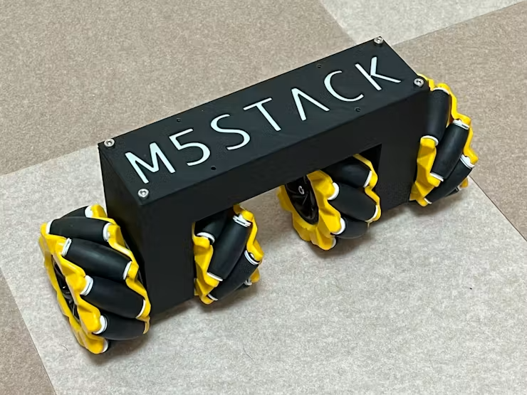

# Roller485 Mecanum Inverted Pendulum

Roller485を4台と80 mmメカナムホイールを使った、横一列配置の倒立振子ロボットです。本体側ファームウェアとAtom JoyStickコントローラー側ファームウェアを1つのリポジトリにまとめています。



[動作動画を見る](https://youtu.be/hXI0RIIv_HM)

## 構成

- 本体側: AtomS3R(またはAtomS3) + Roller485 x 4
- コントローラー側: Atom JoyStick
- 通信: ESP-NOW ch 3 ブロードキャスト
- 駆動電源: 7.2 V battery to PWR485
- 車輪: 80 mmメカナムホイール

## ディレクトリ構成

- `firmware/pendulum`: AtomS3R + Roller485 x 4 の本体側ファームウェア
- `firmware/controller`: Atom JoyStickコントローラー側ファームウェア
- `docs`: ESP-NOWパケット、配線、操作説明、安全注意の補足資料
- `images`: 写真や図を置くためのディレクトリ

## コントローラー操作

Atom JoyStickコントローラーは、一般的なRC送信機のMode 2配置に合わせています。左スティック上下をThrottle、左スティック左右をRudder、右スティック上下をElevator、右スティック左右をAileronとして扱います。

本機は飛行RCではありませんが、メカナムホイールの動きを説明するときにこの名称が直感的で分かりやすいため、RCのスティック名をそのまま使用しています。詳細は `docs/controller.md` を参照してください。

## 安全上の注意

倒立振子は電源投入後や制御開始時に突然動く可能性があります。初回確認時は必ず車輪を浮かせ、周囲に十分な空間を確保してください。

- 初回確認時は必ず車輪を浮かせてテストしてください。
- 本体側は、有効なESP-NOWパケットを受信するまでモーターを起動しません。
- 本体ボタンだけでの単独起動は安全のため無効にしています。
- 転倒検出時とESP-NOW受信タイムアウト時はモーターを停止します。
- Roller485初期化に失敗した場合、制御タスクは開始されません。

## Roller485の配置とI2Cアドレス

- LEFT = left outer, addr 0x64
- LEFT2 = left inner, addr 0x65
- RIGHT2 = right inner, addr 0x66
- RIGHT = right outer, addr 0x67

## ビルド方法

PlatformIOをインストールした環境で、それぞれのファームウェアディレクトリに移動してビルドします。リポジトリ直下ではなく、`firmware/pendulum` または `firmware/controller` をPlatformIOプロジェクトとして開いてください。

本体側ファームウェア:

```bash
cd firmware/pendulum
pio run
```

コントローラー側ファームウェア:

```bash
cd firmware/controller
pio run
```

初回ビルド時は、PlatformIOがボード定義や依存ライブラリを取得するため、インターネット接続が必要です。

## Roller485ライブラリについて

`unit_rolleri2c` は伊藤先生による修正版を使用しています。公式ライブラリより Roller485 との通信が速く、倒立振子のようにレスポンスが重要な用途では、この修正版を使用するのが適しています。

## OTA設定について

公開用の `platformio.ini` では、Wi-Fi SSIDとパスワードは空文字にしています。OTA書き込みを使う場合は、各自の環境に合わせて `WIFI_SSID`, `WIFI_PASSWORD`, 必要に応じて `OTA_PASSWORD` を設定してください。

## 関連ドキュメント

- `docs/espnow_packet.md`: ESP-NOWパケット仕様
- `docs/wiring.md`: AtomS3R、Roller485、電源まわりの配線
- `docs/controller.md`: Atom JoyStickコントローラーの操作説明
- `docs/safety.md`: 実験時の安全注意

## ライセンス

このリポジトリは複数ライセンスの集合であり、リポジトリ全体をMIT Licenseとするものではありません。個別ファイルの表示と[THIRD_PARTY_NOTICES.md](THIRD_PARTY_NOTICES.md)を優先してください。ライセンス原文は[LICENSES](LICENSES)にあります。

| 対象 | ライセンス／配布条件 | 備考 |
| --- | --- | --- |
| 伊藤恒平氏および片岡淳の独自コード（`firmware/*/src/main.cpp`、`firmware/controller/lib/ATOMS3Joy/`） | MIT | `LICENSES/MIT.txt`。伊藤氏の著作権を有する派生部分は、得たMIT条件の許諾に基づきます。 |
| M5Stack Unit Roller I2Cドライバーおよびbuzzer（`firmware/pendulum/src/unit_rolleri2c.*`、`firmware/controller/src/buzzer.*`） | MIT（M5Stack） | M5Stackのファイル内SPDX表示を保持しています。伊藤氏の高速化改変を含みます。 |
| MadgwickAHRS（`firmware/pendulum/src/MadgwickAHRS.*`） | GPL-3.0-only | Arduino版の上流が「GPL version 3」と明記しているためです。出典は第三者通知を参照してください。 |
| 本体側完成ファームウェア（`firmware/pendulum`） | GPL-3.0-only | MITの個別コードとGPL-3.0-onlyのMadgwickAHRSを結合してビルドするため、完成ファームウェアのソース／バイナリ配布にはGPL-3.0-onlyが適用されます。 |
| コントローラー側独自コード（`firmware/controller/src/`、`lib/ATOMS3Joy/`） | MIT | この行は独自コードだけを対象とします。 |
| コントローラー完成ファームウェア | MITの独自コード + M5Unified/M5GFX と各上流通知 | M5UnifiedはMIT。M5GFXはMITに加え、実際にリンクされるLovyanGFX・フォント・画像処理部の通知があります。GPL、LGPL、CC BY-SA 3.0 の旧M5AtomS3同梱物は含みません。詳細は`THIRD_PARTY_NOTICES.md`を参照してください。 |
| 文書、画像、3Dモデル（`docs/`、`images/`、`3d_models/`） | CC BY 4.0 | Copyright (c) 2026 Atsushi Kataoka。商用利用・再配布・改変を許可し、表示義務があります。`LICENSES/CC-BY-4.0.txt`を参照してください。 |

`LICENSE` はライセンス案内です。MITの原文だけをルートに置いて全ファイルへ適用されるように見せないため、この構成にしています。

```
Copyright (c) 2024 Kouhei Ito
Modifications Copyright (c) 2026 Atsushi Kataoka

Original code by Kouhei Ito. Modified by Atsushi Kataoka.
```
